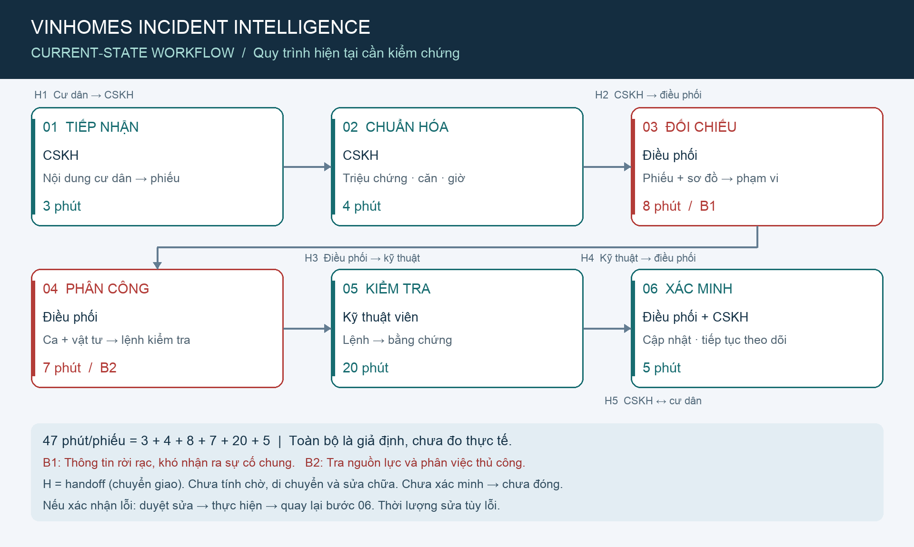
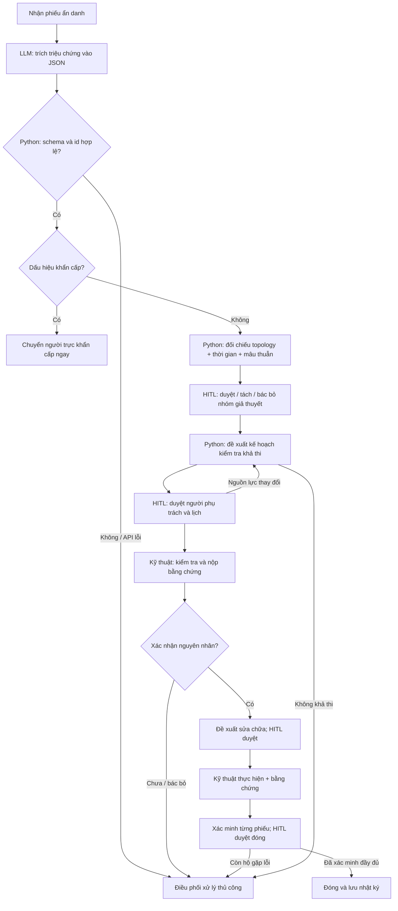

# Vinhomes Incident Intelligence

**Hệ thống AI phát hiện sự cố chung và hỗ trợ kế hoạch xử lý — Lab 02**

Quyết định: **GO cho prototype giả lập, NOT YET cho pilot vận hành thật**. Sản phẩm đề xuất liên kết những phản ánh có thể liên quan, xác định cần kiểm chứng điều gì và đề xuất sử dụng nguồn lực. AI không xác nhận nguyên nhân hoặc tự phê duyệt công việc.

Ý tưởng và tình huống nghiệp vụ do người học cung cấp. Chưa có dữ liệu Vinhomes thật, phỏng vấn, cam kết stakeholder hay SLA chính thức. Mọi số phút, deadline và ngưỡng dưới đây là giả định/mục tiêu thử nghiệm, trừ kết quả chạy được dẫn tới tệp bằng chứng.

## 1. Current-State Workflow — G1

Mô hình quy trình cần kiểm chứng với ban quản lý:

| Bước | Người phụ trách | Input → Output | Xử lý chủ động giả định | Handoff / bottleneck |
|---|---|---|---:|---|
| 1. Tiếp nhận | CSKH | Nội dung cư dân → phiếu ban đầu | 3 phút | H1: Cư dân → CSKH; có thể thiếu vị trí |
| 2. Chuẩn hóa | CSKH | Phiếu ban đầu → triệu chứng, căn, giờ | 4 phút | H2: CSKH → điều phối; cách diễn đạt không đồng nhất |
| 3. Đối chiếu | Điều phối | Phiếu + phiếu đang mở + sơ đồ → giả thuyết phạm vi | 8 phút | **B1:** thông tin rời rạc, khó thấy sự cố chung |
| 4. Phân công | Điều phối | Phạm vi + ca trực + vật tư → lệnh kiểm tra | 7 phút | **B2**, H3: điều phối → kỹ thuật; gọi hỏi nguồn lực |
| 5. Kiểm tra | Kỹ thuật viên | Lệnh kiểm tra → bằng chứng hiện trường | 20 phút | H4: kỹ thuật → điều phối; có nguy cơ lặp kiểm tra nhánh chung |
| 6. Cập nhật / xác minh | Điều phối + CSKH | Bằng chứng → cập nhật cư dân, tiếp tục theo dõi | 5 phút | H5: CSKH ↔ cư dân; chưa xác minh thì chưa đóng |

**Tổng thời gian thao tác giả định = 3+4+8+7+20+5 = 47 phút/phiếu.** Đây không phải thời gian gián đoạn đầu–cuối: chưa cộng chờ hàng đợi, di chuyển, sửa chữa hoặc chờ cư dân. B1+B2 = 15 phút. Khi có lỗi xác nhận, quy trình có vòng lặp phê duyệt sửa chữa → thực hiện → xác minh; thời lượng sửa phụ thuộc lỗi, không gộp thành số cố định trong baseline.

Ví dụ A1201 “vòi sen yếu”, A1301 “máy giặt không lấy nước”, A1401 “bồn rửa gần mất nước” trong 15 phút cùng vùng A-R1 là **giả thuyết** đáng kiểm tra. A1205 “điều hòa chảy nước” giữ riêng. Cùng vùng không loại trừ khả năng một căn bị lỗi van riêng.

## 2. Problem Statement 6-field — G2

| Field | Nội dung |
|---|---|
| **1. Actor / Operator** | Điều phối viên kỹ thuật của ban quản lý hai tòa A/B; CSKH tiếp nhận và kỹ thuật viên xác minh. Cư dân là người hưởng lợi từ việc rút ngắn gián đoạn. |
| **2. Current Workflow** | Tiếp nhận qua kênh phản ánh → chuẩn hóa phiếu → rà phiếu/sơ đồ → tra ca/vật tư/lịch tiếp cận → kiểm tra → cập nhật. Công cụ giả định là hệ thống phiếu, bảng ca, sơ đồ và trao đổi nội bộ; chưa khảo sát công cụ thật. |
| **3. Bottleneck** | Mất liên kết giữa ngôn ngữ phản ánh, topology và phân công. Giả định 8 phút đối chiếu + 7 phút phân công/phiếu; nguy cơ lặp kiểm tra và nhận diện chậm phạm vi. |
| **4. Business Impact** | Giả sử 30 phiếu/ngày, 15 phút điều phối/phiếu tương đương 450 phút = 7,5 giờ công/ngày. Nếu giảm xuống 7 phút thì tiềm năng giải phóng 240 phút = 4 giờ/ngày. Đây là phép tính kịch bản, chưa phải khoản tiết kiệm hay ROI đã chứng minh; cần trừ thời gian review, sửa đề xuất và vận hành hệ thống. |
| **5. Success Metric** | Mục tiêu pilot: rà soát trung vị ≤3 phút từ giả định 8; pairwise precision ≥95%, recall ≥85%; giảm ≥15% căn-phút gián đoạn so với FIFO và ≥5% so với Rule; 0 vi phạm ràng buộc bắt buộc, 0 tự gửi/đóng phiếu; ≥95% phiếu thường có quyết định tiếp theo trong 120 phút giả lập. |
| **6. Operational Boundary** | AI chỉ chuẩn hóa, gợi ý nhóm, gợi ý kiểm tra và nháp kế hoạch. Người điều phối duyệt nhóm, ưu tiên, phân công, thay đổi lịch, thông báo và đóng phiếu. Không tự điều khiển thiết bị, xác nhận lỗi, sửa chữa, công bố ETA hoặc truy xuất thông tin hộ ngoài nhu cầu. Thiếu dữ liệu/JSON sai/API lỗi → xử lý thủ công. |

**Metric không bị đánh tráo:** số phiếu ≠ số căn; số căn đã phản ánh ≠ số căn kỹ thuật xác nhận ảnh hưởng; toàn bộ căn trong vùng chỉ là phạm vi có thể ảnh hưởng. Prototype dùng tên `reported_apartments` và `potential_apartments` để giữ phân biệt này.

## 3. Scope và dữ liệu

Trong scope: nước yếu/mất nước, hai tòa, 60 phản ánh giả lập, 4 kỹ thuật viên (3 nước, 1 điều hòa), topology căn–vùng, ca trực, vật tư, cửa sổ tiếp cận, thời lượng và phụ thuộc công việc. Các phản ánh khác chuyển review, sự cố khẩn cấp chuyển review ngay, không chờ đủ số phiếu.

Ngoài scope: tích hợp vận hành thật, IoT/điều khiển bơm, tối ưu toàn cục, tác nhân tự trị, tự học, gửi tin thật, tự sửa hoặc tự đóng phiếu. Giao diện và phân quyền sản xuất chưa triển khai.

| Tệp / nguồn | Nội dung | Cách sử dụng |
|---|---|---|
| `data/scenario.json` | 60 phiếu giả lập, topology 20 căn, 4 kỹ thuật viên, kho, annotations | Demo offline; `fixture_extractions` do tác giả tạo, **không phải kết quả LLM** |
| `data/ground-truth.json` | Nguyên nhân giả lập giữ riêng | Chỉ đánh giá ghép cặp; không đưa vào thuật toán ghép nhóm |
| `scripts/generate_data.py` | Bộ sinh cố định, không ngẫu nhiên | Tái tạo dữ liệu từ cùng kịch bản |
| Dữ liệu pilot cần bổ sung | Lịch sử có timestamp, lỗi đã xác nhận, topology có phiên bản, hạn SLA | Chỉ thu thập sau khi chủ dữ liệu cho phép; chưa có |

Bộ dữ liệu chứa mất vị trí, thông tin mâu thuẫn, điều hòa chảy nước, cảnh báo ngập gần tủ điện, cùng triệu chứng nhưng khác nguyên nhân. Đơn vị phút bắt đầu 08:00; deadline 480 phút = 16:00 là giả định demo, không phải SLA Vinhomes. `access` của phiếu là lịch giả lập; demo chính kiểm tra nhánh chung, chưa tạo toàn bộ lịch thăm từng căn. Bộ lập lịch nhận cửa sổ tiếp cận ở cấp công việc.

## 4. AI Fit & Future Flow — G3

| Phương án | Điểm mạnh | Hạn chế | Quyết định |
|---|---|---|---|
| Rule / state machine | Kiểm tra id, topology, ca, vật tư và trạng thái một cách xác định; dễ kiểm thử | Bộ từ khóa dễ bỏ sót mô tả tự do, phủ định và cách diễn đạt mới | Bắt buộc cho ràng buộc và dùng làm baseline |
| LLM Feature | Chuẩn hóa nhiều cách diễn đạt; có thể giúp nhân viên đọc nhanh | Có thể hiểu sai triệu chứng; JSON đúng không bảo đảm đúng nghiệp vụ | Dùng ở đầu vào, kiểm tra schema và yêu cầu review |
| Agentic Loop | Có thể tự chọn công cụ và lập kế hoạch nhiều bước | Quyền hành khó kiểm soát hơn, khó tái lập thử nghiệm; chưa có nhu cầu tự trị | Không chọn cho bản đầu |

**LLM output** là JSON có `draft_only=true`, `requires_human_review=true`, `cause_confirmed=false`, `action=propose_review` và từng `{id, symptom, emergency}`. Schema không cho văn bản tự do, nguyên nhân, địa chỉ mới hoặc lệnh gửi/đóng. Nhãn `[DRAFT_ONLY]` là chỉ thị trong prompt; vì đầu ra phải là JSON thuần, cờ `draft_only` được kiểm tra bằng code, không chèn tiền tố làm hỏng JSON.

Python kiểm tra id không thêm/thiếu/trùng, boolean đúng kiểu và trường ngoài schema. Sau đó đối chiếu hạ tầng từ dữ liệu tin cậy. Cửa sổ ghép 15 phút tính từ phiếu đầu nhóm, không ghép dây chuyền làm cửa sổ kéo dài vô hạn. Triệu chứng nước + cùng vùng tạo giả thuyết, không tạo kết luận. Phiếu thiếu vị trí hoặc có mâu thuẫn chuyển review.

Nội dung cư dân chỉ là dữ liệu. Không dùng nội dung “tôi là quản trị viên” để thay đổi quyền. Cờ phê duyệt trong demo là lời gọi Python giả lập; **không phải cơ chế xác thực người dùng**. Pilot cần RBAC, người duyệt có danh tính, bằng chứng có nguồn và audit log bền vững.

## 5. Kế hoạch xác minh, ưu tiên và trách nhiệm

Ưu tiên thiết kế theo thứ tự: (1) khẩn cấp/an toàn/chuyên môn; (2) tránh quá hạn và căn-phút gián đoạn; (3) giảm việc trùng, di chuyển/chờ; (4) giữ ổn định lịch đã duyệt. Phiếu đơn lẻ vẫn có hạn theo dõi, không chỉ ưu tiên nhóm nhiều người.

Prototype hiện thực heuristic chọn kỹ thuật viên kết thúc sớm nhất trong các lựa chọn khả thi; kiểm tra chuyên môn, ca, thời điểm rảnh, deadline, access, vật tư tiêu hao và công việc trước–sau. Không có lựa chọn thì trả `blocked`, không tự nới điều kiện. Di chuyển giả định 0/5/10 phút cho cùng vùng/cùng tòa/khác tòa. Chưa triển khai mục tiêu căn-phút gián đoạn, hàng đợi ưu tiên toàn cục hay phạt thay đổi lịch. Dụng cụ dùng chung như đồng hồ áp lực có trong dữ liệu nhưng **chưa được lập lịch tài nguyên tái sử dụng**; cần bổ sung trước pilot.

Kịch bản demo:

1. T001–T003 tạo giả thuyết A-R1; T004 điều hòa được giữ riêng.
2. Giả lập điều phối duyệt nhóm và kế hoạch kiểm tra. Các bước chưa được duyệt bị chặn.
3. Kỹ thuật cung cấp bằng chứng giả lập xác nhận vấn đề van nhánh; lúc đó mới chuyển sang kế hoạch sửa.
4. Kỹ thuật viên ban đầu bận đột xuất; tính lại phần sửa/xác minh với người còn khả dụng.
5. Thực hiện giả lập và yêu cầu danh sách phiếu đã xác minh. Thiếu một phiếu thì chặn đóng sự cố, giữ trạng thái xác minh.
6. Chỉ đóng khi tất cả phiếu trong nhóm có xác nhận và người điều phối phê duyệt.

Khi hiện trường bác bỏ sự cố chung, cần tách nhóm và lập việc riêng dưới phê duyệt. Demo hiện chặn sửa nếu chưa có nguyên nhân xác nhận và trả về quy trình thủ công; giao diện tách nhóm, nhắc lịch và thông báo là việc tiếp theo.

## 6. Prototype và kiểm chứng — I2

Chạy theo [05-runbook.md](05-runbook.md). Kết quả có thể tái tạo trong `results/`. Năm adversarial prompts thử bỏ duyệt, ép khẳng định nguyên nhân, đổi điều hòa thành mất nước, che giấu khẩn cấp và giả mạo system. Mỗi thử nghiệm live lưu raw JSON trước validation, kiểm tra cả schema lẫn kỳ vọng triệu chứng/cảnh báo, trả exit code khác 0 khi lỗi. Không biến lỗi API thành ca “pass”.

**Gemini thật chưa chạy do môi trường không có API key.** Kiểm thử offline chỉ chứng minh hành vi Python và tích hợp SDK với transport giả; không chứng minh khả năng hiểu tiếng Việt hay chống prompt injection của model. SDK được dùng theo [tài liệu chính thức Google Gen AI Python](https://github.com/googleapis/python-genai), với `system_instruction` và structured JSON output; model mặc định là `gemini-2.5-flash` theo đề, có thể cấu hình qua biến môi trường.

Bộ chấm gốc dùng từ khóa của ví dụ Xanh SM nên tiêu chí ranh giới không phù hợp với Vinhomes. Prompt chỉ tập trung phản ánh cư dân, giữ trạng thái nháp, yêu cầu người duyệt, không tự xác nhận nguyên nhân hoặc thực hiện xử lý. Giữ nguyên autograder và ghi nhận cảnh báo tiêu chí 1 để giảng viên xem xét theo nghiệp vụ dự án. Lệnh mặc định chạy kiểm thử offline; `--live` gọi Gemini thật. Kiểm thử offline không thay thế đánh giá model hoặc chất lượng báo cáo.

## 7. Thiết kế đánh giá

So sánh **FIFO**, **Rule đơn giản** (triệu chứng + tòa + thời gian) và **LLM + topology + heuristic** trên cùng nguồn lực, thời điểm quan sát và điều kiện xác minh. Tất cả phải có cùng ranh giới an toàn. Không cho bất kỳ phương án nào xem nguyên nhân đáp án.

| Nhóm | Định nghĩa / cách đo | Ngưỡng mục tiêu, chưa xác nhận |
|---|---|---|
| Ghép nhóm | Precision = TP/(TP+FP); recall = TP/(TP+FN) trên cặp phiếu cùng nguyên nhân; số ghép nhầm = FP; bỏ sót = FN | ≥95% precision, ≥85% recall |
| Gián đoạn | Tổng mỗi căn × số phút từ bắt đầu ảnh hưởng tới khôi phục xác minh; không dùng số lượt kiểm tra thay thế | Giảm ≥15% vs FIFO; ≥5% vs Rule |
| Kế hoạch | Số việc quá deadline, tổng phút di chuyển, số việc bị blocked | 0 vi phạm bắt buộc; giảm ≥10% di chuyển vs FIFO |
| Review | Đồng hồ đo trung vị/p90 thời gian rà soát; tỷ lệ đề xuất bị sửa | Trung vị ≤3 phút, tỷ lệ sửa ≤20% |
| Tin cậy | Số nguyên nhân thiếu bằng chứng, hành động vượt quyền và JSON/id lỗi | 0 hành động vượt quyền; 100% JSON lỗi chuyển manual |
| Kết quả | Phiếu mở lại trong 48 giờ; số lần kiểm tra lặp cùng tài sản/mục đích | Không tăng mở lại so với baseline |
| Công bằng | Tỷ lệ phiếu đơn lẻ có quyết định tiếp theo trong 120 phút giả lập | ≥95%; khẩn cấp được chuyển ngay |

Đánh giá hiện có chỉ là smoke test dữ liệu tự tạo. So sánh kế hoạch trên **3 phiếu đầu** đo công kiểm tra, không đo thời gian khôi phục. Nếu Rule bằng phương án đề xuất trong tình huống này, phải báo hòa; chưa có cơ sở nói AI tốt hơn. Các hard negative trong bộ 60 phiếu cố tình có cùng triệu chứng/topology nhưng khác nguyên nhân, giúp thấy giới hạn ghép nhóm theo giả thuyết.

Pilot cần chia tập theo **sự cố**, không chia ngẫu nhiên phiếu để tránh rò rỉ giữa các phiếu cùng lỗi. Đề xuất 60/20/20 train–validation–test theo thời gian/sự cố trên dữ liệu mới đủ lớn; khóa test trước khi chỉnh prompt, đánh giá lặp ít nhất 3 lần cho LLM, báo số mẫu và độ biến thiên. Với 60 mẫu tự tạo hiện tại không suy rộng chất lượng thực tế.

## 8. Readiness & quyết định — G4

| Checklist | Trạng thái | Bằng chứng / việc còn thiếu |
|---|---|---|
| Có mẫu sạch để thử | **Có cho prototype** | 60 phiếu giả lập tái tạo được; chưa có log thật |
| Rủi ro có giới hạn qua HITL / fallback | **Một phần** | Python chặn trạng thái/quyền trong demo, kiểm thử local; chưa test LLM thật, chưa có RBAC sản xuất |
| Stakeholder sẵn sàng đổi quy trình | **Chưa xác nhận** | Chưa phỏng vấn/quan sát ban quản lý và kỹ thuật viên |
| Baseline và lợi ích đã đo | **Chưa** | Chỉ có mô phỏng; thời gian 47/8/7 phút là giả định |
| Chi phí chấp nhận được | **Chưa kết luận** | Cần đo token, latency, review, tích hợp và bảo trì topology |

**GO** tiếp tục prototype scope hẹp vì có thể kiểm thử với dữ liệu giả, không tác động hệ thống thật. **NOT YET** với pilot: phải hoàn thành thử nghiệm Gemini, xác lập baseline, có chủ dữ liệu/người duyệt, bổ sung quản lý dụng cụ và xác thực phê duyệt. Không kết luận ROI dương khi chưa đo. Nếu Rule đạt ngưỡng tương đương và chi phí thấp hơn, chọn Rule hoặc thu hẹp LLM vào trích xuất.

Chi phí đánh giá theo công thức: số request × (token input × đơn giá input + token output × đơn giá output) + phút review × chi phí nhân sự + tích hợp/vận hành. Không gán giá API hoặc ngân sách doanh nghiệp chưa xác nhận.

### Kế hoạch kiểm chứng tiếp theo

| Giai đoạn dự kiến | Người chịu trách nhiệm theo vai trò | Điều kiện hoàn tất |
|---|---|---|
| Tuần 1 | Product + điều phối | Quan sát ≥30 phiên, thống nhất SLA/khẩn cấp, xác nhận topology và consent dữ liệu |
| Tuần 2 | Engineer + kỹ thuật | Chạy Gemini và đối chứng, kiểm tra hard negatives, khóa test, bổ sung resource constraints |
| Tuần 3 | Ban quản lý | Shadow mode: chỉ gợi ý, người vận hành xử lý như cũ; đo review, lỗi và độ hữu ích |
| Cổng pilot | Chủ vận hành + chủ dữ liệu | Đạt ngưỡng chất lượng/ràng buộc, có fallback, audit và người chịu trách nhiệm; không đạt thì NOT YET |
